# Database Design - PostBoy API Testing Platform

**Version:** 1.0.0  
**Database:** PostgreSQL  
**ORM:** Prisma  
**Last Updated:** September 30, 2025

---

## 📋 Table of Contents

1. [Overview](#overview)
2. [Entity Relationship Diagram](#entity-relationship-diagram)
3. [Core Modules](#core-modules)
4. [Detailed Schema](#detailed-schema)
5. [Relationships & Constraints](#relationships--constraints)
6. [Indexes & Performance](#indexes--performance)
7. [Security Considerations](#security-considerations)

---

## Overview

PostBoy is a comprehensive API testing platform similar to Postman, built with Next.js and Prisma. The database architecture supports:

- **Authentication & Authorization**: Better Auth integration with OAuth providers
- **Multi-tenancy**: Workspace-based isolation with role-based access control
- **API Testing**: REST API collections, requests, and execution history
- **Real-time Communication**: WebSocket preset management and message logging
- **Environment Management**: Variable management across different environments

### Technology Stack
- **Database**: PostgreSQL (with JSON support)
- **ORM**: Prisma v6.16.2
- **Authentication**: Better Auth (OAuth: Google, GitHub)
- **ID Strategy**: CUID for most entities, custom IDs for Better Auth models

---

## Entity Relationship Diagram

### Complete ERD (Mermaid)


### Module Visualization

```mermaid
graph TB
    subgraph AUTH["🔐 Authentication Module"]
        U[User]
        S[Session]
        A[Account]
        V[Verification]
        
        U -->|has| S
        U -->|has| A
    end

    subgraph WORKSPACE["🏢 Workspace Module"]
        W[Workspace]
        WM[WorkspaceMember]
        WI[WorkspaceInvite]
        
        U -->|owns| W
        U -->|member of| WM
        U -->|creates| WI
        W -->|has| WM
        W -->|has| WI
    end

    subgraph API["🚀 API Testing Module"]
        C[Collection]
        R[Request]
        RR[RequestRun]
        
        W -->|contains| C
        C -->|has| R
        R -->|executed as| RR
    end

    subgraph ENV["🌍 Environment Module"]
        E[Environment]
        
        W -->|has| E
    end

    subgraph WS["🔌 WebSocket Module"]
        WP[WebSocketPreset]
        WM2[WebsocketMessage]
        
        W -->|has| WP
        WP -->|logs| WM2
    end

    style AUTH fill:#e1f5ff
    style WORKSPACE fill:#fff3e0
    style API fill:#e8f5e9
    style ENV fill:#f3e5f5
    style WS fill:#fce4ec
```



---

## Core Modules

### 1. Authentication Module (Better Auth Compatible)

**Purpose**: Handle user authentication, session management, and OAuth integration

**Models**:
- `User`: Core user identity
- `Session`: Active user sessions with tokens
- `Account`: OAuth provider accounts (Google, GitHub)
- `Verification`: Email verification and password reset tokens

**Key Features**:
- OAuth 2.0 support (Google, GitHub)
- Session-based authentication with token expiry
- Email verification system
- IP address and user agent tracking

---

### 2. Workspace Module

**Purpose**: Multi-tenant workspace management with role-based access control

**Models**:
- `Workspace`: Isolated containers for API collections
- `WorkspaceMember`: User membership with roles (ADMIN, EDITOR, VIEWER)
- `WorkspaceInvite`: Time-limited invite system with unique tokens

**Key Features**:
- Workspace ownership (one owner per workspace)
- Role-based permissions (ADMIN, EDITOR, VIEWER)
- Invite system with expiring tokens
- Unique workspace names per owner

---

### 3. API Testing Module

**Purpose**: Core API testing functionality - collections, requests, and execution history

**Models**:
- `Collection`: Organized groups of API requests
- `Request`: HTTP request configurations (method, URL, headers, body)
- `RequestRun`: Execution history with responses and timing

**Key Features**:
- REST API support (GET, POST, PUT, PATCH, DELETE)
- JSON storage for headers, parameters, and body
- Response caching in request model
- Complete execution history with performance metrics

---

### 4. Environment Module

**Purpose**: Manage variables across different environments (dev, staging, prod)

**Models**:
- `Environment`: Key-value pairs for environment-specific variables

**Key Features**:
- JSON storage for flexible variable types
- Workspace-scoped environments
- Variable interpolation support (implementation in application layer)

---

### 5. WebSocket Module

**Purpose**: WebSocket connection management and message logging

**Models**:
- `WebSocketPreset`: Reusable WebSocket connection configurations
- `WebsocketMessage`: Bi-directional message logging

**Key Features**:
- Preset management with protocols and parameters
- Direction tracking (INCOMING/OUTGOING)
- Message metadata storage
- Connection ID tracking for session management

---

## Detailed Schema

### User Model
```prisma
model User {
  id            String    @id                 // Custom ID (Better Auth)
  name          String                        // Display name
  email         String    @unique             // Login identifier
  emailVerified Boolean   @default(false)     // Verification status
  image         String?                       // Profile picture URL
  createdAt     DateTime  @default(now())
  updatedAt     DateTime  @updatedAt

  // Relations
  sessions         Session[]           // Active sessions
  accounts         Account[]           // OAuth accounts
  workspaces       Workspace[]         // Owned workspaces
  memberships      WorkspaceMember[]   // Workspace memberships
  workspaceInvites WorkspaceInvite[]   // Created invites
}
```

**Indexes**: 
- Primary: `id`
- Unique: `email`

**Constraints**:
- Email must be unique across platform
- Cascade delete sessions, accounts, workspaces, memberships, and invites

---

### Session Model
```prisma
model Session {
  id        String   @id                     // Custom ID (Better Auth)
  expiresAt DateTime                         // Session expiration
  token     String   @unique                 // Auth token
  createdAt DateTime @default(now())
  updatedAt DateTime @updatedAt
  ipAddress String?                          // Client IP
  userAgent String?                          // Browser/client info

  userId    String
  user      User     @relation(...)          // Owner
}
```

**Indexes**:
- Primary: `id`
- Unique: `token`
- Foreign Key: `userId` → `User.id`

**Constraints**:
- Token must be unique
- Cascade delete when user is deleted

---

### Workspace Model
```prisma
model Workspace {
  id          String      @id @default(cuid())
  name        String                              // Workspace name
  description String?                             // Optional description
  ownerId     String                              // Creator/owner
  
  // Relations
  owner            User               @relation(...)
  collections      Collection[]       // API collections
  members          WorkspaceMember[]  // Team members
  invites          WorkspaceInvite[]  // Pending invites
  environments     Environment[]      // Variables
  websocketPresets WebSocketPreset[]  // WebSocket configs
  
  createdAt   DateTime @default(now())
  updatedAt   DateTime @updatedAt

  @@unique([name, ownerId])           // Unique name per owner
}
```

**Indexes**:
- Primary: `id`
- Unique Composite: `(name, ownerId)`
- Foreign Key: `ownerId` → `User.id`

**Constraints**:
- Each user can have multiple workspaces with unique names
- Cascade delete all related entities when workspace is deleted

---

### WorkspaceMember Model
```prisma
enum MEMBER_ROLE {
  ADMIN   // Full access + invite/remove members
  EDITOR  // Create/edit collections and requests
  VIEWER  // Read-only access
}

model WorkspaceMember {
  id          String      @id @default(cuid())
  role        MEMBER_ROLE @default(ADMIN)
  userId      String
  workspaceId String

  user        User       @relation(...)
  workspace   Workspace  @relation(...)

  createdAt   DateTime   @default(now())
  updatedAt   DateTime   @updatedAt

  @@unique([userId, workspaceId])   // One membership per user/workspace
}
```

**Indexes**:
- Primary: `id`
- Unique Composite: `(userId, workspaceId)`
- Foreign Keys: `userId` → `User.id`, `workspaceId` → `Workspace.id`

**Constraints**:
- User can only be a member once per workspace
- Default role is ADMIN for workspace owner

---

### Collection Model
```prisma
model Collection {
  id          String     @id @default(cuid())
  name        String                          // Collection name
  workspaceId String
  
  workspace   Workspace  @relation(...)       // Parent workspace
  requests    Request[]                       // API requests

  createdAt   DateTime   @default(now())
  updatedAt   DateTime   @updatedAt
}
```

**Indexes**:
- Primary: `id`
- Foreign Key: `workspaceId` → `Workspace.id`

**Constraints**:
- Cascade delete all requests when collection is deleted

---

### Request Model
```prisma
enum REST_METHOD {
  GET
  POST
  PUT
  PATCH
  DELETE
}

model Request {
  id          String      @id @default(cuid())
  name        String                              // Request name
  method      REST_METHOD @default(GET)           // HTTP method
  url         String                              // Endpoint URL
  parameters  Json?                               // Query params
  headers     Json?                               // HTTP headers
  body        Json?                               // Request body
  response    Json?                               // Last response cache
  collectionId String

  collection   Collection  @relation(...)         // Parent collection
  runs         RequestRun[]                       // Execution history

  createdAt   DateTime     @default(now())
  updatedAt   DateTime     @updatedAt
}
```

**JSON Structure Examples**:
```json
// parameters
{
  "page": "1",
  "limit": "10",
  "sort": "desc"
}

// headers
{
  "Content-Type": "application/json",
  "Authorization": "Bearer {{token}}"
}

// body
{
  "name": "John Doe",
  "email": "john@example.com"
}
```

**Indexes**:
- Primary: `id`
- Foreign Key: `collectionId` → `Collection.id`

**Constraints**:
- Cascade delete all runs when request is deleted

---

### RequestRun Model
```prisma
model RequestRun {
  id         String   @id @default(cuid())
  requestId  String
  status     Int                                  // HTTP status code
  statusText String?                             // Status message
  headers    Json?                               // Response headers
  body       String?                             // Response body
  durationMs Int?                                // Execution time

  request    Request  @relation(...)             // Parent request
  createdAt  DateTime @default(now())
}
```

**Indexes**:
- Primary: `id`
- Foreign Key: `requestId` → `Request.id`
- Index recommended: `createdAt` (for history queries)

**Constraints**:
- Immutable after creation (no updates)
- Cascade delete when parent request is deleted

---

### Environment Model
```prisma
model Environment {
  id          String     @id @default(cuid())
  name        String                          // e.g., "Development", "Production"
  values      Json                            // Key-value pairs
  workspaceId String

  workspace   Workspace  @relation(...)       // Parent workspace
}
```

**JSON Structure Example**:
```json
{
  "BASE_URL": "https://api.example.com",
  "API_KEY": "sk_live_xxxxx",
  "AUTH_TOKEN": "Bearer xxxxx",
  "TIMEOUT": "5000"
}
```

**Indexes**:
- Primary: `id`
- Foreign Key: `workspaceId` → `Workspace.id`

---

### WebSocketPreset Model
```prisma
model WebSocketPreset {
  id         String   @id @default(cuid())
  name       String                            // Preset name
  url        String                            // WebSocket URL
  protocols  Json?                             // Sub-protocols
  params     Json?                             // Connection params
  workspaceId String?

  workspace  Workspace? @relation(...)         // Parent workspace
  websocketMessages WebsocketMessage[]         // Message history

  createdAt  DateTime @default(now())
  updatedAt  DateTime @updatedAt
}
```

**JSON Structure Examples**:
```json
// protocols
["soap", "wamp"]

// params
{
  "token": "{{WS_TOKEN}}",
  "room": "chat-123"
}
```

**Indexes**:
- Primary: `id`
- Foreign Key: `workspaceId` → `Workspace.id`

**Constraints**:
- Set workspace to NULL if workspace is deleted (onDelete: SetNull)

---

### WebsocketMessage Model
```prisma
enum DIRECTION {
  INCOMING  // Server → Client
  OUTGOING  // Client → Server
}

model WebsocketMessage {
  id          String     @id @default(cuid())
  presetId    String?
  connectionId String?                         // Session identifier
  direction   DIRECTION  @default(INCOMING)    // Message direction
  payload     String?                          // Message content
  size        Int?                             // Bytes
  timestamp   DateTime   @default(now())
  meta        Json?                            // Additional metadata

  preset      WebSocketPreset? @relation(...)  // Source preset
}
```

**Indexes**:
- Primary: `id`
- Foreign Key: `presetId` → `WebSocketPreset.id`
- Index recommended: `timestamp` (for log queries)

**Constraints**:
- Set preset to NULL if preset is deleted

---

## Relationships & Constraints

### Cascade Delete Rules

```
User (deleted)
  ├─→ Session (CASCADE)
  ├─→ Account (CASCADE)
  ├─→ Workspace (CASCADE)
  │    ├─→ Collection (CASCADE)
  │    │    └─→ Request (CASCADE)
  │    │         └─→ RequestRun (CASCADE)
  │    ├─→ Environment (CASCADE)
  │    ├─→ WorkspaceMember (CASCADE)
  │    ├─→ WorkspaceInvite (CASCADE)
  │    └─→ WebSocketPreset (SET NULL)
  │         └─→ WebsocketMessage (SET NULL)
  └─→ WorkspaceMember (CASCADE)
```

### Unique Constraints

1. **User.email**: Global uniqueness
2. **Session.token**: Global uniqueness for auth
3. **WorkspaceInvite.token**: Global uniqueness for invite links
4. **Workspace (name, ownerId)**: Unique name per owner
5. **WorkspaceMember (userId, workspaceId)**: One membership per user/workspace

---

## Indexes & Performance

### Recommended Indexes

```sql
-- Authentication lookups
CREATE INDEX idx_session_token ON "Session"("token");
CREATE INDEX idx_session_user ON "Session"("userId");

-- Workspace access
CREATE INDEX idx_workspace_owner ON "Workspace"("ownerId");
CREATE INDEX idx_workspace_member_user ON "WorkspaceMember"("userId");
CREATE INDEX idx_workspace_member_workspace ON "WorkspaceMember"("workspaceId");

-- Collection hierarchy
CREATE INDEX idx_collection_workspace ON "Collection"("workspaceId");
CREATE INDEX idx_request_collection ON "Request"("collectionId");

-- History queries
CREATE INDEX idx_request_run_created ON "RequestRun"("createdAt");
CREATE INDEX idx_request_run_request ON "RequestRun"("requestId");

-- WebSocket logs
CREATE INDEX idx_websocket_message_timestamp ON "WebsocketMessage"("timestamp");
CREATE INDEX idx_websocket_message_preset ON "WebsocketMessage"("presetId");
```

### Query Optimization Tips

1. **Workspace Access**: Always filter by `workspaceId` to leverage row-level security
2. **History Pagination**: Use `createdAt` with cursor-based pagination for RequestRun
3. **JSON Queries**: Consider GIN indexes for JSONB columns if doing complex queries
4. **Batch Operations**: Use Prisma transactions for multi-step operations

---

## Security Considerations

### Row-Level Security (RLS) Recommendations

While Prisma doesn't enforce RLS at the ORM level, implement these checks in your application:

1. **Workspace Isolation**:
   ```typescript
   // Always verify workspace access
   const member = await prisma.workspaceMember.findUnique({
     where: {
       userId_workspaceId: {
         userId: session.userId,
         workspaceId: workspaceId
       }
     }
   });
   
   if (!member) throw new UnauthorizedError();
   ```

2. **Role-Based Authorization**:
   ```typescript
   // Check permissions based on role
   const canEdit = member.role === 'ADMIN' || member.role === 'EDITOR';
   const canDelete = member.role === 'ADMIN';
   ```

3. **Invite Token Security**:
   - Generate cryptographically secure tokens
   - Set reasonable expiration times (24-48 hours)
   - Invalidate tokens after use

4. **Session Management**:
   - Rotate session tokens periodically
   - Track IP addresses and user agents
   - Implement session revocation

### Data Validation

1. **URL Validation**: Validate request URLs before storage
2. **JSON Schema**: Validate JSON fields against schemas
3. **Input Sanitization**: Sanitize all user inputs, especially in JSON fields
4. **Rate Limiting**: Implement on request execution endpoints

---

## Migration Strategy

### Initial Setup

```bash
# Generate Prisma Client
npx prisma generate

# Create migration
npx prisma migrate dev --name init

# Seed database (optional)
npx prisma db seed
```

### Future Schema Changes

1. **Adding Fields**: Use `@default()` for new required fields
2. **Removing Fields**: Two-step migration (deprecate → remove)
3. **Renaming**: Use `@map()` to preserve database column names
4. **Breaking Changes**: Create data migration scripts

---

## Appendix

### Entity Count Estimates (for a typical workspace)

| Entity | Expected Volume | Growth Rate |
|--------|----------------|-------------|
| Users | 1-100 | Slow |
| Workspaces | 1-10 per user | Slow |
| Collections | 10-100 per workspace | Medium |
| Requests | 50-1000 per collection | Medium |
| RequestRuns | 100-10000 per request | Fast |
| Environments | 3-10 per workspace | Slow |
| WebSocketPresets | 5-50 per workspace | Slow |
| WebsocketMessages | 100-100000 | Fast |

### Storage Considerations

- **RequestRun** and **WebsocketMessage** tables will grow fastest
- Consider archival strategy for runs older than 30-90 days
- Implement pagination for all list endpoints
- Monitor JSON field sizes (headers, body, response)

---

## Version History

| Version | Date | Changes |
|---------|------|---------|
| 1.0.0 | Sep 30, 2025 | Initial database design |

---

**Maintained by**: PostBoy Development Team  
**Questions?**: Open an issue on GitHub
