# System Design - PostBoy API Testing Platform

**Version:** 2.0.0  
**Framework:** Next.js 15.5.4 (App Router + Turbopack)  
**Last Updated:** October 1, 2025 (Major Update)

---

## 📋 Table of Contents

1. [Executive Summary](#executive-summary)
2. [System Architecture Overview](#system-architecture-overview)
3. [User Journey & Flow](#user-journey--flow)
4. [Frontend Architecture](#frontend-architecture)
5. [Backend Architecture](#backend-architecture)
6. [State Management](#state-management)
7. [Data Flow](#data-flow)
8. [Component Hierarchy](#component-hierarchy)
9. [API Design](#api-design)
10. [Security & Authentication](#security--authentication)
11. [Performance Considerations](#performance-considerations)
12. [Future Enhancements](#future-enhancements)

---

## Executive Summary

**PostBoy** is a modern, full-stack API testing platform built with Next.js, designed to provide developers with an intuitive interface for testing REST APIs. The application follows a **multi-tenant architecture** with workspace-based isolation, OAuth authentication, and real-time collaboration features.

### Key Features Implemented:
- ✅ OAuth Authentication (Google, GitHub)
- ✅ Multi-workspace Management
- ✅ Collection & Request Organization
- ✅ Request Playground with Tabs
- ✅ HTTP Method Support (GET, POST, PUT, DELETE, PATCH)
- ✅ Headers, Parameters & Body Editing with Auto-save (Debounced)
- ✅ **Default Headers** (Content-Type, Accept, User-Agent)
- ✅ Real-time UI Updates with Toast Notifications
- ✅ Keyboard Shortcuts (Ctrl+G, Ctrl+S)
- ✅ Click-to-Open Requests from Collections
- ✅ **Response Viewer** with Monaco Editor
- ✅ **Headers Tab** with Search & Filter
- ✅ **Saved & Unsaved Request Execution**
- ✅ Request History & Run Tracking
- ✅ Error Handling with User Feedback

### Technology Stack:
- **Frontend**: Next.js 15.5.4, React 19, TypeScript
- **Styling**: Tailwind CSS v4 (OKLCH), shadcn/ui components
- **State**: Zustand (client), TanStack Query (server)
- **Backend**: Next.js Server Actions, Prisma ORM
- **Database**: PostgreSQL with JsonValue types
- **Auth**: Better Auth (OAuth)
- **HTTP Client**: Axios (with custom error handling)
- **Code Editor**: Monaco Editor (VS Dark theme)
- **Notifications**: Sonner (toast library)

---

## System Architecture Overview

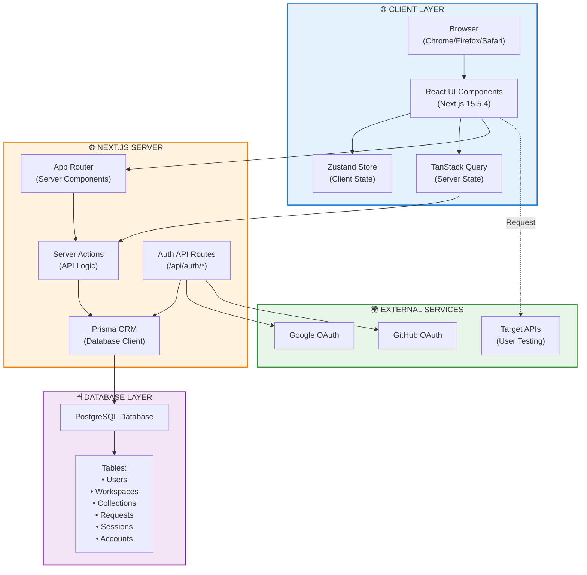

---

## User Journey & Flow

### 1. **Initial Landing (Unauthenticated)**

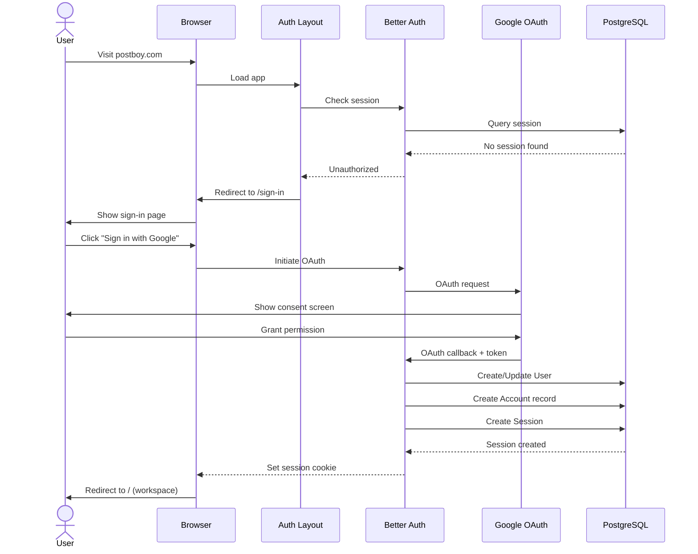

**Files Involved:**
- `src/app/(auth)/sign-in/page.tsx` - Sign-in UI
- `src/app/(auth)/layout.tsx` - Auth layout with redirect logic
- `src/lib/auth.ts` - Better Auth configuration
- `src/app/api/auth/[...all]/route.ts` - Auth API routes

---

### 2. **Workspace Initialization (First Login)**

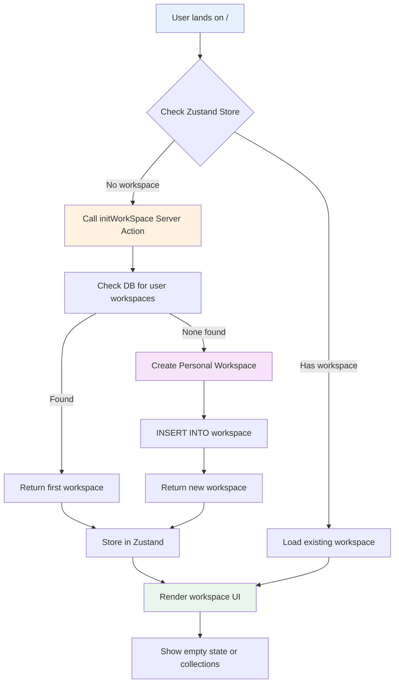

**Files Involved:**
- `src/app/(workspace)/page.tsx` - Main workspace page
- `src/modules/Workspace/actions/index.ts` - initWorkSpace server action
- `src/modules/Layout/Store.ts` - useWorkspaceStore (Zustand)
- `src/modules/Workspace/hooks/workspace.ts` - useGetWorkspace, useCreateWorkspace

---

### 3. **Creating First Collection**

```
User in workspace → Sidebar visible
         ↓
┌─────────────────────────────────┐
│  Sidebar (Left Panel)           │
│  • Collections Tab              │
│  • History Tab                  │
│  • Environments Tab             │
│  • [+ Create Collection] Button │
└─────────────────────────────────┘
         ↓
User clicks "+ Create Collection"
         ↓
┌─────────────────────────────────┐
│  Create Collection Modal        │
│  • Name Input                   │
│  • Description Input            │
│  • Create Button                │
└─────────────────────────────────┘
         ↓
User enters "My API Collection"
         ↓
Clicks "Create"
         ↓
useCreateCollection mutation
         ↓
Server Action: createCollection()
         ↓
INSERT INTO collection
         ↓
TanStack Query invalidates cache
         ↓
UI refreshes → Collection appears in sidebar
```

**Files Involved:**
- `src/modules/Workspace/components/Sidebar.tsx` - Sidebar with tabs
- `src/modules/collections/components/create-collection.tsx` - Create modal
- `src/modules/collections/hooks/collection.ts` - useCreateCollection
- `src/modules/collections/actions/index.ts` - createCollection server action

---

### 4. **Adding Request to Collection**

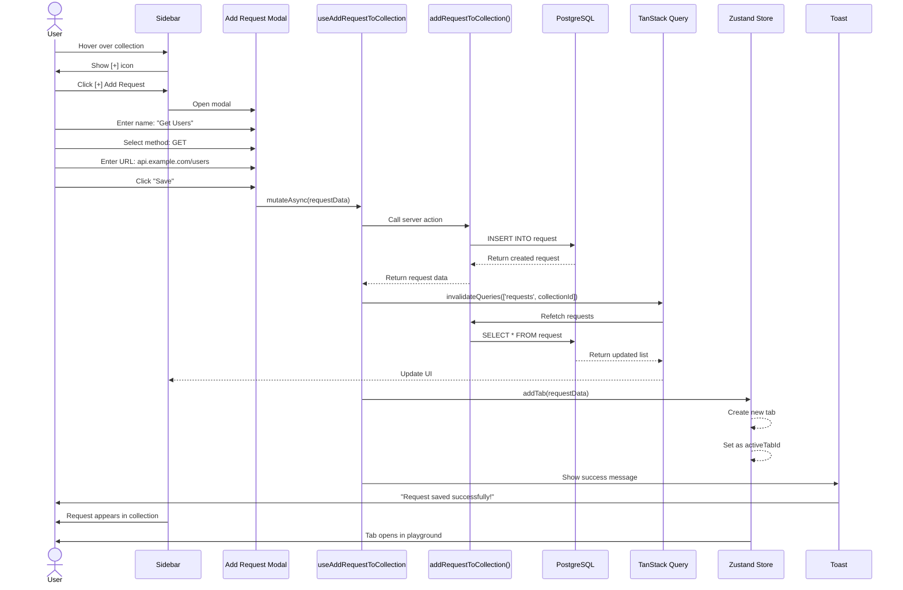

**Files Involved:**
- `src/modules/request/components/add-request-model.tsx` - Add request modal
- `src/modules/collections/components/collection-folder.tsx` - Collection UI
- `src/modules/request/hooks/Request.ts` - useAddRequestToCollection
- `src/modules/request/actions/index.ts` - addRequestToCollection server action
- `src/modules/request/store/useRequestStore.ts` - Tab management

---

### 5. **Request Playground - Opening & Editing Request**

```
User clicks on saved request in collection
         ↓
onClick handler calls: openRequestTab(request)
         ↓
Zustand Store checks if tab already exists
         ↓
Case A: Tab exists
  → setActiveTab(existingTab.id)
  
Case B: Tab doesn't exist
  → Create new tab with request data
  → Add to tabs array
  → Set as activeTabId
         ↓
┌─────────────────────────────────────────────────────────┐
│  Request Playground (Center Panel)                      │
│  ┌────────────────────────────────────────────────────┐ │
│  │  Tab Bar                                           │ │
│  │  [GET Get Users ×] [POST Create User ×] [+]       │ │
│  └────────────────────────────────────────────────────┘ │
│  ┌────────────────────────────────────────────────────┐ │
│  │  Request Bar (Postman-style)                      │ │
│  │  [GET ▼] [URL Input.....................] [Send]  │ │
│  └────────────────────────────────────────────────────┘ │
│  ┌────────────────────────────────────────────────────┐ │
│  │  Request Editor Tabs                              │ │
│  │  [Parameters] [Headers] [Body]                    │ │
│  │  ┌──────────────────────────────────────────────┐ │ │
│  │  │  Key-Value Editor                            │ │ │
│  │  │  [Content-Type] [application/json] [✓] [×]  │ │ │
│  │  │  [Authorization] [Bearer token...] [✓] [×]  │ │ │
│  │  │  [+] Add new row                             │ │ │
│  │  └──────────────────────────────────────────────┘ │ │
│  └────────────────────────────────────────────────────┘ │
│  ┌────────────────────────────────────────────────────┐ │
│  │  Response Viewer (Future)                         │ │
│  │  • Status, Time, Size                            │ │
│  │  • Body, Headers tabs                            │ │
│  └────────────────────────────────────────────────────┘ │
└─────────────────────────────────────────────────────────┘
```

**Files Involved:**
- `src/modules/request/components/request-playground.tsx` - Main playground
- `src/modules/request/components/tab-bar.tsx` - Tab management UI
- `src/modules/request/components/request-bar.tsx` - Method + URL + Send button
- `src/modules/request/components/request-editor.tsx` - Main editor container
- `src/modules/request/components/request-editor-area.tsx` - Tabs (Params/Headers/Body)
- `src/modules/request/components/key-value-form.tsx` - Headers/Params editor
- `src/modules/request/components/body-editor.tsx` - Monaco code editor
- `src/modules/request/store/useRequestStore.ts` - Tab state management

---

### 6. **Editing Request (Headers, Parameters, Body)**

#### **A. Adding Headers**

```
User in Request Playground → Clicks "Headers" tab
         ↓
┌─────────────────────────────────────────────────────────┐
│  Key-Value Form Editor                                  │
│  ┌─────────────┬──────────────────┬──────┬──────┐      │
│  │ Key         │ Value            │ On/Off│ Del  │      │
│  ├─────────────┼──────────────────┼──────┼──────┤      │
│  │ Content-    │ application/json │  ✓   │  ×   │      │
│  │ Type        │                  │      │      │      │
│  ├─────────────┼──────────────────┼──────┼──────┤      │
│  │ Authori-    │ Bearer token123  │  ✓   │  ×   │      │
│  │ zation      │                  │      │      │      │
│  ├─────────────┼──────────────────┼──────┼──────┤      │
│  │             │                  │  ✓   │  ×   │      │
│  └─────────────┴──────────────────┴──────┴──────┘      │
│  [+ Add Header]                                         │
└─────────────────────────────────────────────────────────┘
         ↓
User edits headers
         ↓
useDebounce (500ms) triggers
         ↓
handleHeadersChange() called
         ↓
Filter enabled items: item.enabled !== false
Filter non-empty: item.key.trim() || item.value.trim()
         ↓
JSON.stringify(filteredHeaders)
         ↓
updateTab(tab.id, { headers: "..." })
         ↓
Zustand updates tab state
         ↓
Toast: "Headers updated successfully"
```

**Key Logic:**
```typescript
const filteredHeaders = data.filter((item) => 
  item.enabled !== false && (item.key.trim() || item.value.trim())
);
```

---

#### **B. Editing Body (JSON)**

```
User clicks "Body" tab
         ↓
┌─────────────────────────────────────────────────────────┐
│  Body Editor (Monaco Editor)                            │
│  ┌───────────────────────────────────────────────────┐  │
│  │ Content-Type: [application/json ▼]                │  │
│  │ [Generate] [Format] [Copy] [Clear]                │  │
│  ├───────────────────────────────────────────────────┤  │
│  │ 1  {                                              │  │
│  │ 2    "username": "john_doe",                      │  │
│  │ 3    "email": "john@example.com",                 │  │
│  │ 4    "password": "secure123"                      │  │
│  │ 5  }                                              │  │
│  │                                                    │  │
│  ├───────────────────────────────────────────────────┤  │
│  │ Lines: 5 | Characters: 98 | [Auto-save ●]        │  │
│  └───────────────────────────────────────────────────┘  │
└─────────────────────────────────────────────────────────┘
         ↓
User types JSON
         ↓
Monaco onChange event
         ↓
useDebounce (500ms)
         ↓
handleBodyChange({ body: newBody })
         ↓
updateTab(tab.id, { body: newBody })
         ↓
Marks tab as unsaved: unsavedChanges: true
         ↓
Tab shows dot indicator: "GET Get Users •"
```

**Files Involved:**
- `src/modules/request/components/body-editor.tsx` - Monaco editor wrapper
- `src/modules/request/hooks/use-debounce.ts` - Debounce hook

---

### 7. **Saving Request Changes**

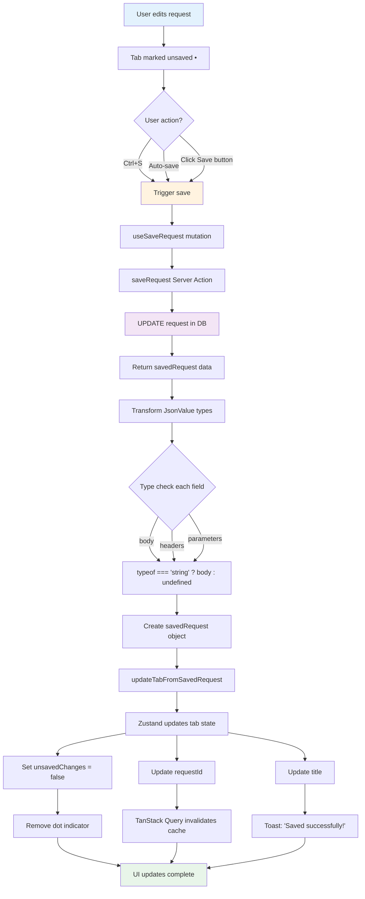

**Type Transformation Logic:**
```typescript
const savedRequest = {
  id: data.id,
  name: data.name,
  method: data.method,
  url: data.url,
  body: typeof data.body === 'string' ? data.body : undefined,
  headers: typeof data.headers === 'string' ? data.headers : undefined,
  parameters: typeof data.parameters === 'string' ? data.parameters : undefined,
};
```

---

### 8. **Keyboard Shortcuts**

```
User Focus → Request Playground
         ↓
Presses: Ctrl+G (Windows) or Cmd+G (Mac)
         ↓
useHotkeys hook catches event
         ↓
setIsAddRequestModalOpen(true)
         ↓
┌─────────────────────────────────┐
│  Add New Request Modal Opens    │
│  • Focus on name input          │
│  • Pre-filled with defaults     │
└─────────────────────────────────┘
```

**Other Shortcuts:**
- `Ctrl+S` - Save current request
- `Ctrl+R` - Add request to collection (in sidebar)
- `Ctrl+E` - Rename collection
- `Ctrl+D` - Delete collection

**Files Involved:**
- `src/modules/request/components/request-playground.tsx` - useHotkeys
- `react-hotkeys-hook` library

---

## Frontend Architecture

### **Component Tree Structure**

```mermaid
graph TD
    App[App Root]
    
    App --> AuthGroup["(auth) Route Group"]
    App --> WorkspaceGroup["(workspace) Route Group"]
    
    AuthGroup --> AuthLayout[layout.tsx - Auth Layout]
    AuthLayout --> SignIn[sign-in/page.tsx]
    
    WorkspaceGroup --> WorkspaceLayout[layout.tsx - Workspace Layout]
    WorkspaceLayout --> Providers[Providers Wrapper]
    Providers --> ReactQuery[ReactQueryProviders]
    Providers --> Theme[ThemeProvider]
    Providers --> Settings[SettingsProvider]
    Providers --> Toaster[Sonner Toaster]
    
    WorkspaceLayout --> WorkspacePage[page.tsx - Main Workspace]
    WorkspacePage --> ResizableGroup[ResizablePanelGroup]
    
    ResizableGroup --> SidebarPanel[Sidebar Panel 30%]
    ResizableGroup --> Handle[ResizableHandle]
    ResizableGroup --> PlaygroundPanel[Playground Panel 70%]
    
    SidebarPanel --> TabbedSidebar[TabbedSidebar]
    TabbedSidebar --> CollectionsTab[Collections Tab]
    TabbedSidebar --> HistoryTab[History Tab Future]
    TabbedSidebar --> EnvTab[Environments Tab Future]
    
    CollectionsTab --> CollectionFolder[CollectionFolder Component]
    CollectionFolder --> CollectionHeader[Collection Header]
    CollectionFolder --> RequestList[Request List]
    
    RequestList --> RequestItem[Request Item]
    RequestItem --> MethodBadge[Method Badge]
    RequestItem --> ReqName[Name]
    RequestItem --> ReqURL[URL]
    RequestItem --> ReqActions[Actions Edit/Delete]
    
    PlaygroundPanel --> PlaygroundPage[PlaygroundPage]
    PlaygroundPage --> EmptyState[Empty State No Tabs]
    PlaygroundPage --> ActiveState[Active State Has Tabs]
    
    ActiveState --> TabBar[TabBar]
    ActiveState --> RequestEditor[RequestEditor]
    
    TabBar --> Tab[Tab Component]
    Tab --> TabMethod[Method Badge]
    Tab --> TabTitle[Title]
    Tab --> TabUnsaved[Unsaved Indicator]
    Tab --> TabClose[Close Button]
    
    RequestEditor --> RequestBar[RequestBar]
    RequestBar --> MethodSelector[Method Selector]
    RequestBar --> URLInput[URL Input]
    RequestBar --> ValidIcon[Validation Icon]
    RequestBar --> SendBtn[Send Button]
    
    RequestEditor --> EditorArea[RequestEditorArea]
    EditorArea --> EditorTabs[Tabs: Params/Headers/Body]
    EditorArea --> ParamsContent[Parameters Content]
    EditorArea --> HeadersContent[Headers Content]
    EditorArea --> BodyContent[Body Content]
    
    ParamsContent --> KeyValueForm1[KeyValueFormEditor]
    HeadersContent --> KeyValueForm2[KeyValueFormEditor]
    BodyContent --> BodyEditor[BodyEditor Monaco]
    
    RequestEditor --> ResponseViewer[ResponseViewer Future]
    
    WorkspacePage --> Modals[Global Modals]
    Modals --> AddRequestModal[AddRequestModal]
    Modals --> SaveToCollectionModal[SaveToCollectionModal]
    Modals --> EditRequestModal[EditRequestModal]
    Modals --> DeleteRequestModal[DeleteRequestModal]
    Modals --> CreateCollectionModal[CreateCollectionModal]
    Modals --> EditCollectionModal[EditCollectionModal]
    Modals --> DeleteCollectionModal[DeleteCollectionModal]
    
    style App fill:#e3f2fd,stroke:#1976d2,stroke-width:3px
    style WorkspacePage fill:#fff3e0,stroke:#f57c00,stroke-width:2px
    style PlaygroundPage fill:#f3e5f5,stroke:#7b1fa2,stroke-width:2px
    style RequestEditor fill:#e8f5e9,stroke:#388e3c,stroke-width:2px
```
        │                   │   ├── Headers Content
        │                   │   │   └── KeyValueFormEditor
        │                   │   │
        │                   │   └── Body Content
        │                   │       └── BodyEditor
        │                   │           ├── Content-Type Selector
        │                   │           ├── Monaco Editor
        │                   │           ├── Action Buttons
        │                   │           └── Stats Footer
        │                   │
        │                   └── ResponseViewer (Future)
        │                       ├── Status Badge
        │                       ├── Time, Size
        │                       └── Body/Headers Tabs
        │
        └── Modals (Global)
            ├── AddRequestModal
            ├── SaveToCollectionModal
            ├── EditRequestModal
            ├── DeleteRequestModal
            ├── CreateCollectionModal
            ├── EditCollectionModal
            └── DeleteCollectionModal
```

---

### **Component Responsibilities**

| Component | Responsibility | State Management |
|-----------|---------------|------------------|
| `request-playground.tsx` | Main container, tab management, empty states | Zustand: useRequestPlaygroundStore |
| `tab-bar.tsx` | Tab UI, switching, closing tabs | Props from playground |
| `request-bar.tsx` | HTTP method selector, URL input, Send button | Local state + props |
| `request-editor.tsx` | Container for editor area | Wrapper component |
| `request-editor-area.tsx` | Tab switching (Params/Headers/Body), data parsing | Local state + Zustand |
| `key-value-form.tsx` | Editable key-value pairs with enable/disable | Local state (rows) |
| `body-editor.tsx` | Monaco editor for JSON/text, formatting | Local state + debounce |
| `collection-folder.tsx` | Collection display, expand/collapse, actions | TanStack Query + local |
| `Sidebar.tsx` | Tab switching, collection list | TanStack Query |

---

## Backend Architecture

### **Server Actions Pattern**

```typescript
// File: src/modules/request/actions/index.ts

export const addRequestToCollection = async (
  request: Request, 
  collectionId: string
) => {
  const user = await currentUser();
  if (!user) throw new Error("Unauthorized");

  const newRequest = await db.request.create({
    data: {
      name: request.name,
      url: request.url,
      method: request.method,
      collectionId,
      headers: request.headers || {},
      parameters: request.parameters || {},
      body: request.body || {},
    },
  });

  return newRequest;
};
```

### **Server Action Files**

| File | Actions | Purpose |
|------|---------|---------|
| `modules/request/actions/index.ts` | addRequest, editRequest, deleteRequest, saveRequest, getAllRequests | Request CRUD operations |
| `modules/collections/actions/index.ts` | createCollection, editCollection, deleteCollection, getCollections | Collection CRUD |
| `modules/Workspace/actions/index.ts` | initWorkSpace, createWorkspace, getWorkspace | Workspace management |

---

## State Management

```mermaid
graph TB
    subgraph CLIENT_STATE["🎯 CLIENT STATE (Zustand)"]
        PlaygroundStore[useRequestPlaygroundStore]
        WorkspaceStore[useWorkspaceStore]
        
        PlaygroundStore --> Tabs[tabs: RequestTab array]
        PlaygroundStore --> ActiveTab[activeTabId: string null]
        PlaygroundStore --> TabMethods[Methods: addTab, closeTab, updateTab, etc.]
        
        WorkspaceStore --> SelectedWS[selectedWorkspace: Workspace null]
        WorkspaceStore --> SetWS[setSelectedWorkspace]
    end
    
    subgraph SERVER_STATE["⚡ SERVER STATE (TanStack Query)"]
        Queries[Queries]
        Mutations[Mutations]
        Cache[Query Cache]
        
        Queries --> GetWorkspaces[useWorkspaces]
        Queries --> GetCollections[useCollections workspaceId]
        Queries --> GetRequests[useGetAllRequestsInCollection collectionId]
        
        Mutations --> CreateCollection[useCreateCollection]
        Mutations --> AddRequest[useAddRequestToCollection]
        Mutations --> SaveRequest[useSaveRequest]
        Mutations --> EditRequest[useEditRequest]
        Mutations --> DeleteRequest[useDeleteRequest]
        
        GetWorkspaces --> Cache
        GetCollections --> Cache
        GetRequests --> Cache
        
        Mutations -.invalidates.-> Cache
    end
    
    subgraph COMPONENTS["🎨 COMPONENTS"]
        Playground[RequestPlayground]
        Sidebar[TabbedSidebar]
        Editor[RequestEditor]
        
        Playground --> PlaygroundStore
        Editor --> PlaygroundStore
        Sidebar --> GetCollections
        Sidebar --> GetRequests
        
        Playground --> AddRequest
        Editor --> SaveRequest
    end
    
    subgraph PERSISTENCE["💾 PERSISTENCE"]
        LocalStorage[localStorage]
        Database[(PostgreSQL)]
        
        WorkspaceStore -.sync.-> LocalStorage
        Mutations --> Database
        Queries --> Database
    end
    
    style CLIENT_STATE fill:#e3f2fd,stroke:#1976d2,stroke-width:2px
    style SERVER_STATE fill:#fff3e0,stroke:#f57c00,stroke-width:2px
    style COMPONENTS fill:#f3e5f5,stroke:#7b1fa2,stroke-width:2px
    style PERSISTENCE fill:#e8f5e9,stroke:#388e3c,stroke-width:2px
```

### **Zustand Stores**

#### **1. useRequestPlaygroundStore**

**File:** `src/modules/request/store/useRequestStore.ts`

```typescript
interface PlaygroundState {
  tabs: RequestTab[];
  activeTabId: string | null;
  
  // Methods
  addTab: (tabData?: Partial<RequestTab>) => void;
  closeTab: (id: string) => void;
  setActiveTab: (id: string) => void;
  updateTab: (id: string, data: Partial<RequestTab>) => void;
  markUnsaved: (id: string, value: boolean) => void;
  openRequestTab: (req: any) => void;
  updateTabFromSavedRequest: (tabId: string, savedRequest: SavedRequest) => void;
}
```

**Responsibilities:**
- Manage multiple request tabs
- Track active tab
- Handle tab CRUD operations
- Track unsaved changes
- Open requests from collections (check for duplicates)

**Key Features:**
- **Duplicate Prevention**: `openRequestTab` checks if request is already open
- **Pre-fill Support**: `addTab` accepts partial tab data
- **Unsaved Tracking**: Marks tabs dirty on updates

---

#### **2. useWorkspaceStore**

**File:** `src/modules/Layout/Store.ts`

```typescript
interface WorkspaceState {
  selectedWorkspace: Workspace | null;
  setSelectedWorkspace: (workspace: Workspace) => void;
}
```

**Responsibilities:**
- Store currently selected workspace
- Persist across page refreshes (localStorage)

---

### **TanStack Query (React Query)**

**Used For:** Server state synchronization, caching, mutations

#### **Queries:**
```typescript
// Get all collections in workspace
useCollections(workspaceId)

// Get all requests in collection
useGetAllRequestsInCollection(collectionId)

// Get workspace details
useGetWorkspace(workspaceId)
```

#### **Mutations:**
```typescript
// Add request to collection
useAddRequestToCollection(collectionId)

// Save request changes
useSaveRequest(requestId)

// Edit request
useEditRequest(requestId, collectionId)

// Delete request
useDeleteRequest(collectionId)
```

**Invalidation Strategy:**
```typescript
onSuccess: (data) => {
  queryClient.invalidateQueries({ queryKey: ['requests', collectionId] });
  queryClient.invalidateQueries({ queryKey: ['collections'] });
}
```

---

## Data Flow

### **Complete Request Creation Flow**

```mermaid
stateDiagram-v2
    [*] --> UserAction: User clicks "Add Request"
    UserAction --> UIState: Open modal
    UIState --> FormInput: User fills form
    
    state FormInput {
        [*] --> Name: Enter "Get Users"
        Name --> Method: Select GET
        Method --> URL: Enter api.example.com/users
        URL --> [*]: Click Save
    }
    
    FormInput --> MutationTrigger: mutateAsync(requestData)
    MutationTrigger --> ServerAction: Call server action
    
    state ServerAction {
        [*] --> Auth: Validate user
        Auth --> DB: INSERT INTO request
        DB --> [*]: Return created request
    }
    
    ServerAction --> QueryInvalidation: invalidateQueries(['requests'])
    QueryInvalidation --> BackgroundRefetch: Trigger refetch
    
    ServerAction --> ZustandUpdate: addTab(requestData)
    
    state ZustandUpdate {
        [*] --> CreateTab: Generate tab ID
        CreateTab --> PopulateData: Set title, method, URL
        PopulateData --> SetActive: Set as activeTabId
        SetActive --> [*]: Add to tabs array
    }
    
    ZustandUpdate --> UIUpdate: Trigger re-render
    BackgroundRefetch --> UIUpdate: Update sidebar
    
    state UIUpdate {
        [*] --> CloseModal
        CloseModal --> ShowInSidebar
        ShowInSidebar --> OpenTab
        OpenTab --> ShowToast
        ShowToast --> [*]
    }
    
    UIUpdate --> [*]: Complete
```

---

### **Request Edit & Save Flow**

```
┌──────────────────────────────────────────────────────────────┐
│ 1. USER EDITS                                                │
│    User changes URL or adds headers                          │
└──────────────┬───────────────────────────────────────────────┘
               ↓
┌──────────────────────────────────────────────────────────────┐
│ 2. DEBOUNCED UPDATE                                          │
│    useDebounce(value, 500ms)                                 │
│    → Prevents excessive updates                              │
└──────────────┬───────────────────────────────────────────────┘
               ↓
┌──────────────────────────────────────────────────────────────┐
│ 3. ZUSTAND UPDATE                                            │
│    updateTab(tabId, { headers: newHeaders })                 │
│    markUnsaved(tabId, true) → Shows dot indicator            │
└──────────────┬───────────────────────────────────────────────┘
               ↓
┌──────────────────────────────────────────────────────────────┐
│ 4. SAVE TRIGGER (Ctrl+S or Button)                          │
│    useSaveRequest(requestId).mutateAsync()                   │
└──────────────┬───────────────────────────────────────────────┘
               ↓
┌──────────────────────────────────────────────────────────────┐
│ 5. SERVER ACTION                                             │
│    saveRequest(requestId, requestData)                       │
│    UPDATE request SET ... WHERE id = requestId               │
└──────────────┬───────────────────────────────────────────────┘
               ↓
┌──────────────────────────────────────────────────────────────┐
│ 6. TYPE TRANSFORMATION                                       │
│    Convert JsonValue → string | undefined                    │
│    (Fix Prisma JSON type incompatibility)                    │
└──────────────┬───────────────────────────────────────────────┘
               ↓
┌──────────────────────────────────────────────────────────────┐
│ 7. ZUSTAND SYNC                                              │
│    updateTabFromSavedRequest(tabId, savedRequest)            │
│    ├── Update requestId (if new)                             │
│    ├── Mark as saved: unsavedChanges = false                 │
│    └── Remove dot indicator                                  │
└──────────────┬───────────────────────────────────────────────┘
               ↓
┌──────────────────────────────────────────────────────────────┐
│ 8. CACHE INVALIDATION                                        │
│    queryClient.invalidateQueries(['requests'])               │
│    → Sidebar updates with latest data                        │
└──────────────────────────────────────────────────────────────┘
```

---

## API Design

### **REST API Endpoints (Internal)**

All API routes are Server Actions, not traditional REST endpoints. However, they follow RESTful conventions:

#### **Workspace APIs**

```typescript
// GET - Get workspace
getWorkspace(workspaceId: string): Promise<Workspace>

// POST - Create workspace
createWorkspace(name: string, userId: string): Promise<Workspace>

// POST - Initialize user's personal workspace
initWorkSpace(): Promise<Workspace>
```

#### **Collection APIs**

```typescript
// GET - Get all collections in workspace
getAllCollections(workspaceId: string): Promise<Collection[]>

// POST - Create collection
createCollection(name: string, description: string, workspaceId: string): Promise<Collection>

// PUT - Edit collection
editCollection(collectionId: string, data: Partial<Collection>): Promise<Collection>

// DELETE - Delete collection
deleteCollection(collectionId: string): Promise<void>
```

#### **Request APIs**

```typescript
// GET - Get all requests in collection
getAllRequestsInCollection(collectionId: string): Promise<Request[]>

// POST - Add request to collection
addRequestToCollection(request: Request, collectionId: string): Promise<Request>

// PUT - Save/update request
saveRequest(requestId: string, request: Request): Promise<Request>

// PUT - Edit request
editRequest(requestId: string, request: Request): Promise<Request>

// DELETE - Delete request
deleteRequest(requestId: string): Promise<void>
```

---

### **Authentication API (Better Auth)**

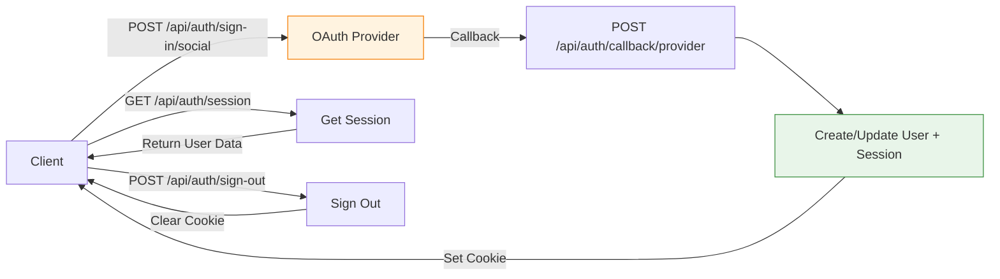

**API Endpoints:**

```
POST /api/auth/sign-in/social
  → OAuth sign-in (Google, GitHub)

POST /api/auth/sign-out
  → Sign out user

GET /api/auth/session
  → Get current session

POST /api/auth/callback/[provider]
  → OAuth callback handler
```

**Configuration:**
```typescript
// src/lib/auth.ts
export const auth = betterAuth({
  database: prismaAdapter(db, {
    provider: "postgresql",
  }),
  socialProviders: {
    github: {
      clientId: env.GITHUB_CLIENT_ID,
      clientSecret: env.GITHUB_CLIENT_SECRET,
    },
    google: {
      clientId: env.GOOGLE_CLIENT_ID,
      clientSecret: env.GOOGLE_CLIENT_SECRET,
    },
  },
});
```

---

## Security & Authentication

### **Database Schema (Core Tables)**

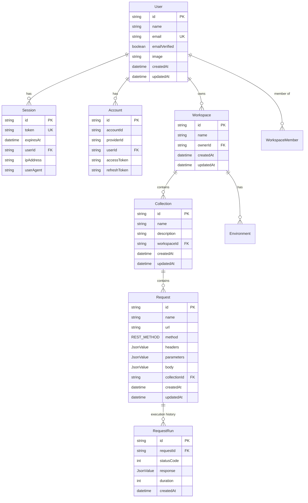

### **Authentication Flow**

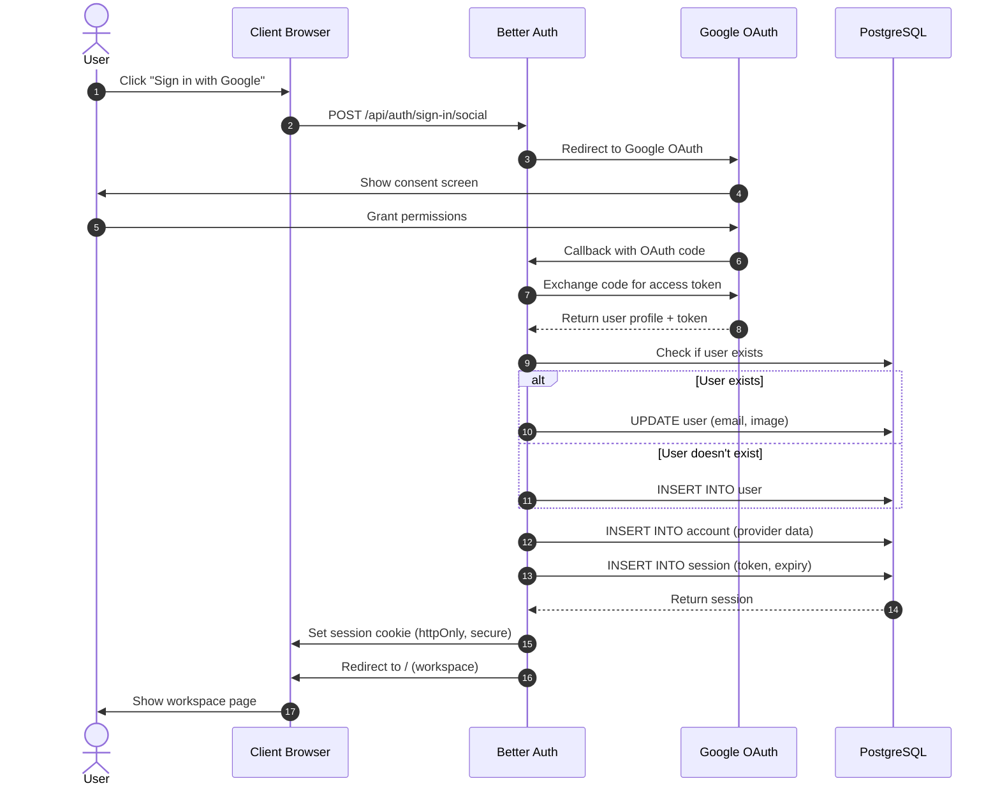

### **Session Management**

```typescript
// Server Component (Layout)
const session = await auth.api.getSession({
  headers: await headers(),
});

if (!session) {
  redirect("/sign-in");
}
```

### **Protected Server Actions**

```typescript
export const createCollection = async (data) => {
  const user = await currentUser();
  
  if (!user) {
    throw new Error("Unauthorized");
  }
  
  // Proceed with action...
};
```

### **Database Security**

**Row-Level Security (RLS) - Implemented via Queries:**

```prisma
// Only fetch user's workspaces
model Workspace {
  ownerId String
  owner   User @relation(...)
}

// Query ensures ownership
const workspace = await db.workspace.findFirst({
  where: {
    id: workspaceId,
    ownerId: userId, // ← Security check
  },
});
```

---

## Performance Considerations

### **Debounce Mechanism - Auto-Save Flow**

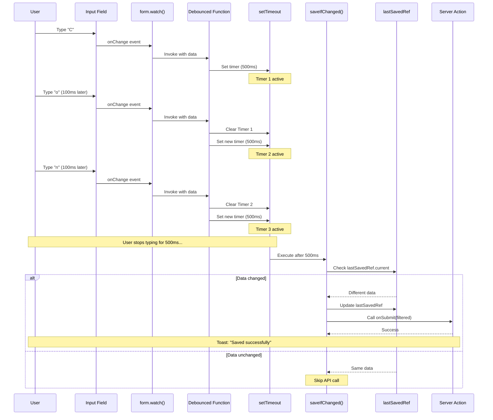

### **1. Code Splitting**

- **Route-based splitting**: Each route loads only its components
- **Dynamic imports**: Heavy components loaded on demand
- **Monaco Editor**: Lazy loaded only when Body tab is active

```typescript
const MonacoEditor = dynamic(() => import('@monaco-editor/react'), {
  ssr: false,
  loading: () => <p>Loading editor...</p>
});
```

---

### **2. Debouncing**

```typescript
// Prevents excessive API calls
const debouncedValue = useDebounce(value, 500);

useEffect(() => {
  // Only runs after user stops typing for 500ms
  handleSave(debouncedValue);
}, [debouncedValue]);
```

---

### **3. Optimistic Updates**

```typescript
const mutation = useMutation({
  mutationFn: saveRequest,
  onMutate: async (newRequest) => {
    // Cancel outgoing queries
    await queryClient.cancelQueries(['requests']);
    
    // Snapshot previous value
    const previousRequests = queryClient.getQueryData(['requests']);
    
    // Optimistically update UI
    queryClient.setQueryData(['requests'], (old) => [...old, newRequest]);
    
    return { previousRequests };
  },
  onError: (err, newRequest, context) => {
    // Rollback on error
    queryClient.setQueryData(['requests'], context.previousRequests);
  },
});
```

---

### **4. Caching Strategy**

```typescript
useQuery({
  queryKey: ['requests', collectionId],
  queryFn: () => getAllRequests(collectionId),
  staleTime: 5 * 60 * 1000, // 5 minutes
  cacheTime: 30 * 60 * 1000, // 30 minutes
});
```

---

### **5. Pagination (Future)**

```typescript
// For large collections
useInfiniteQuery({
  queryKey: ['requests', collectionId],
  queryFn: ({ pageParam = 0 }) => 
    getRequests(collectionId, pageParam),
  getNextPageParam: (lastPage) => lastPage.nextCursor,
});
```

---

## Future Enhancements

### **Phase 2 Features**

1. **Response Viewer**
   - Display API responses
   - Status codes, headers, body
   - Response time and size
   - Pretty-print JSON/XML

2. **Request Execution**
   - Send HTTP requests
   - Handle authentication
   - Store response history
   - Compare responses

3. **Environment Variables**
   - Define variables ({{BASE_URL}})
   - Switch between environments
   - Variable autocomplete

4. **WebSocket Support**
   - Connect to WebSocket servers
   - Send/receive messages
   - Message history

5. **Request History**
   - Track all sent requests
   - Filter by date, status
   - Re-run past requests

6. **Team Collaboration**
   - Share workspaces
   - Role-based access (Admin, Editor, Viewer)
   - Real-time updates

7. **Import/Export**
   - Import Postman collections
   - Export to various formats
   - Backup/restore

8. **Testing & Automation**
   - Test scripts (pre-request, post-response)
   - Assertions
   - Collection runner
   - CI/CD integration

---

## Conclusion

PostBoy is architected as a modern, scalable API testing platform with:

✅ **Clean Architecture**: Separation of concerns (UI, Business Logic, Data)  
✅ **Type Safety**: End-to-end TypeScript  
✅ **Performance**: Optimistic updates, debouncing, code splitting  
✅ **Developer Experience**: Hot reload, keyboard shortcuts, intuitive UI  
✅ **Scalability**: Multi-tenancy, efficient caching, server-side rendering  

The system is designed to handle complex workflows while maintaining excellent performance and user experience.

### **Complete System Overview**

```mermaid
mindmap
  root((PostBoy<br/>API Testing Platform))
    Frontend
      Next.js 15.5.4
        App Router
        React 19
        TypeScript
      Styling
        Tailwind CSS v4
        shadcn/ui
        Theme System
      State Management
        Zustand Client State
        TanStack Query Server State
        React Hook Form Forms
    Backend
      Server Actions
        Request CRUD
        Collection Management
        Workspace Init
      Authentication
        Better Auth
        OAuth Google/GitHub
        Session Management
      Database
        PostgreSQL
        Prisma ORM
        JSON Fields
    Features
      Collections
        Create/Edit/Delete
        Nested Structure
        Request Organization
      Request Playground
        Multi-tab Interface
        Method/URL/Body Editor
        Headers/Params
        Auto-save Debouncing
      Keyboard Shortcuts
        Ctrl+G New Request
        Ctrl+S Save
        Tab Navigation
      UI/UX
        Postman-style Design
        Theme Colors
        Toast Notifications
        Loading States
    Architecture
      Multi-tenancy
        Workspace Isolation
        User Ownership
        Role-based Access Future
      Performance
        Code Splitting
        Optimistic Updates
        Query Caching
        Debouncing
      Security
        OAuth Only
        Session Cookies
        Protected Routes

---

## Recent Updates (Version 2.0.0)

### 1. **Enhanced Request Execution System**

#### Unsaved Request Support
Previously, only saved requests could be executed. Now supports both:

```typescript
// Hook now accepts tab instead of requestId
export function useRunRequest(tab: RequestTab) {
  return useMutation({
    mutationFn: async () => {
      // Saved request
      if (tab.requestId) {
        return await run(tab.requestId);
      }
      
      // Unsaved request
      const requestData: Request = {
        name: tab.title || "Untitled Request",
        method: tab.method as any,
        url: tab.url || "",
        body: tab.body,
        headers: tab.headers,
        parameters: tab.parameters,
      };
      
      return await runUnsavedRequest(requestData);
    },
    // ... success/error handlers
  });
}
```

**Benefits:**
- Test APIs without saving requests
- Faster prototyping workflow
- No database clutter from temporary requests

#### Default Headers System

Automatically includes essential headers on every request:

```typescript
const defaultHeaders: Record<string, string> = {
  'Content-Type': 'application/json; charset=UTF-8',
  'Accept': 'application/json',
  'User-Agent': 'PostBoy/1.0',
};

// Merge with user headers (user headers take precedence)
const mergedHeaders = {
  ...defaultHeaders,
  ...(req.headers || {}),
};
```

**Pre-populated in UI:**
```typescript
const DEFAULT_HEADERS = [
  { key: "Content-Type", value: "application/json; charset=UTF-8", enabled: true },
  { key: "Accept", value: "application/json", enabled: true },
];
```

### 2. **Response Viewer Overhaul**

#### Modern UI Design

**Before:**
- Fixed height (h-96 = 384px)
- Hardcoded dark colors (zinc-950, zinc-900)
- 4 tabs (JSON, Raw, Headers, Test Results)
- No search functionality
- Basic copy functionality

**After:**
- Flexible height (min-h-[600px] with proper flex layout)
- Theme-aware colors (bg-background, text-foreground, border-border)
- 2 essential tabs (Body, Headers)
- Real-time header search
- Toast notifications on actions
- Improved Monaco Editor integration

#### Headers Display & Search

```typescript
// Memoized filtering for performance
const filteredHeaders = useMemo(() => {
  const headers = responseData.requestRun.headers ?? {};
  if (!searchTerm) return Object.entries(headers);
  
  return Object.entries(headers).filter(
    ([key, value]) =>
      key.toLowerCase().includes(searchTerm.toLowerCase()) ||
      value.toLowerCase().includes(searchTerm.toLowerCase())
  );
}, [responseData.requestRun.headers, searchTerm]);
```

**Features:**
- Live search as you type
- Character count badges
- Hover-to-copy buttons
- Empty state messaging
- Monospace font for technical values

#### Status Bar Improvements

**Compact & Information-Dense:**
```tsx
<div className="flex items-center gap-6">
  {/* Color-coded status badge with icon */}
  <div className={`${getStatusBgColor(status)} ${getStatusColor(status)}`}>
    {getStatusIcon(status)} {/* ✓, ⚠, ✕ icons */}
    <span>{status ?? "—"}</span>
    <span>{statusText ?? "No Response"}</span>
  </div>
  
  {/* Inline metrics */}
  <div>⏱ {duration}ms</div>
  <div>💾 {formatBytes(size)}</div>
  <div>📄 {isJson ? "JSON" : "Text"}</div>
</div>
```

### 3. **Data Transformation Pipeline**

#### Problem: Type Mismatches

Prisma stores JSON fields as strings in PostgreSQL, causing type errors:

**Issue Chain:**
1. Headers saved as: `JSON.stringify(result.headers)` → `"{\"content-type\":\"...\"}"` (string)
2. Prisma returns: `JsonValue` type (can be string, object, array, etc.)
3. Components expect: `Record<string, string>` object
4. Empty string `""` causes: `JSON.parse("")` → SyntaxError

#### Solution: Robust Parsing

**In Server Actions (`run` function):**
```typescript
let parsedHeaders: Record<string, string> | undefined;

try {
  if (request.headers) {
    if (typeof request.headers === 'string') {
      parsedHeaders = JSON.parse(request.headers);
    } else if (typeof request.headers === 'object') {
      parsedHeaders = request.headers as Record<string, string>;
    }
  }
} catch (e) {
  console.error('Failed to parse request headers:', e);
  parsedHeaders = undefined;
}
```

**In Hook Transformation:**
```typescript
let parsedHeaders: Record<string, string> = {};
try {
  if (typeof data.requestRun.headers === 'string' && 
      data.requestRun.headers.trim() !== '') {
    parsedHeaders = JSON.parse(data.requestRun.headers);
  } else if (typeof data.requestRun.headers === 'object' && 
             data.requestRun.headers !== null) {
    parsedHeaders = data.requestRun.headers as Record<string, string>;
  }
} catch (e) {
  console.error('Failed to parse headers:', e);
  parsedHeaders = {};
}
```

**Database Save Safety:**
```typescript
headers: result.headers ? JSON.stringify(result.headers) : JSON.stringify({})
```

**Key Principles:**
- Always check type before parsing
- Validate non-empty strings before `JSON.parse()`
- Provide fallback values (`{}` instead of `""`)
- Log errors for debugging
- Never crash on bad data

### 4. **Headers & Parameters Format Standardization**

#### Problem: Array vs Object Format

**Old Format (Array):**
```json
[
  {"key": "Content-Type", "value": "application/json", "enabled": true},
  {"key": "Authorization", "value": "Bearer token", "enabled": true}
]
```

**Issue:** Axios expects `{key: value}` format, not array of objects.

#### Solution: Convert to Object Format

**On Save:**
```typescript
const handleHeadersChange = (data: { key: string; value: string; enabled?: boolean }[]) => {
  const filteredHeaders = data.filter((item) => 
    item.enabled !== false && (item.key.trim() || item.value.trim())
  );
  
  // Convert array to object
  const headersObject = filteredHeaders.reduce((acc, item) => {
    if (item.key.trim()) {
      acc[item.key.trim()] = item.value;
    }
    return acc;
  }, {} as Record<string, string>);
  
  updateTab(tab.id, { headers: JSON.stringify(headersObject) });
};
```

**New Format (Object):**
```json
{
  "Content-Type": "application/json",
  "Authorization": "Bearer token"
}
```

**Backward Compatibility:**
```typescript
const parseKeyValueData = (jsonString?: string) => {
  const parsed = JSON.parse(jsonString);
  
  // If array, return as-is (old format)
  if (Array.isArray(parsed)) {
    return parsed;
  }
  
  // If object, convert to array for form display
  if (typeof parsed === 'object' && parsed !== null) {
    return Object.entries(parsed).map(([key, value]) => ({
      key,
      value: String(value),
      enabled: true
    }));
  }
  
  return [];
};
```

### 5. **Error Handling & User Feedback**

#### Comprehensive Error Management

**At Every Layer:**

1. **Server Action Layer:**
```typescript
try {
  const result = await sendRequest(requestConfig);
} catch (error: any) {
  return {
    success: false,
    error: error.message || "Unknown error",
    requestRun: {
      // Save failed request to database
      status: 0,
      statusText: "Failed",
      headers: JSON.stringify({}),
      body: error.message,
      durationMs: 0,
    }
  };
}
```

2. **Hook Layer:**
```typescript
onError: (error) => {
  console.error('Failed to run request:', error);
  toast.error("Request failed", {
    description: error.message
  });
}
```

3. **Component Layer:**
```typescript
try {
  await mutateAsync();
  toast.success("Request sent successfully!");
} catch (error) {
  toast.error("Failed to send request.");
} finally {
  setIsSending(false);
}
```

#### Toast Notifications

**Success States:**
- ✅ "Request sent successfully!"
- ✅ "Headers updated successfully"
- ✅ "Response copied to clipboard!"
- ✅ "Response downloaded successfully!"

**Error States:**
- ❌ "Failed to send request"
- ❌ "Failed to copy to clipboard"
- ❌ "Please enter a valid URL"

### 6. **Performance Optimizations**

#### useMemo for Expensive Operations

**Response Body Parsing:**
```typescript
const { responseBody, formattedJsonString, rawBody, isJson } = useMemo(() => {
  let body: any = {};
  let formatted = "";
  let isJsonResponse = false;
  const raw = responseData?.requestRun?.body;

  try {
    if (typeof raw === "string") {
      body = raw.length ? JSON.parse(raw) : raw;
      isJsonResponse = true;
    } else {
      body = raw ?? {};
    }
    formatted = JSON.stringify(body, null, 2);
  } catch (e) {
    body = raw ?? {};
    formatted = typeof body === "string" ? body : JSON.stringify(body, null, 2);
  }

  return { responseBody: body, formattedJsonString: formatted, rawBody: raw, isJson: isJsonResponse };
}, [responseData]);
```

**Header Filtering:**
```typescript
const filteredHeaders = useMemo(() => {
  const headers = responseData.requestRun.headers ?? {};
  if (!searchTerm) return Object.entries(headers);
  
  return Object.entries(headers).filter(
    ([key, value]) =>
      key.toLowerCase().includes(searchTerm.toLowerCase()) ||
      value.toLowerCase().includes(searchTerm.toLowerCase())
  );
}, [responseData.requestRun.headers, searchTerm]);
```

**Benefits:**
- Parse response body only when data changes
- Filter headers only when search term or headers change
- Prevent unnecessary re-renders
- Improve scroll performance

#### Debounced Auto-save

Already implemented in key-value-form.tsx using custom debounce with useRef pattern.

### 7. **Console Logging for Debugging**

Strategic logging at critical points:

```typescript
// 1. Request preparation
console.log('sendRequest called with:', {
  method, url, headers, parameters
});

// 2. Request body
console.log('Request body being sent:', {
  originalBody, parsedBody
});

// 3. Response received
console.log('Axios response received:', {
  status, statusText, data, dataType: typeof data
});

// 4. Data transformation
console.log('Response data being set:', transformedData);

// 5. Component reception
console.log('Headers in response viewer:', headers);
console.log('Headers type:', typeof headers);
```

**Debugging Workflow:**
1. Check what's sent to API
2. Check what API returns
3. Check how it's transformed
4. Check what component receives
5. Identify where data is lost/corrupted

### 8. **Type Safety Improvements**

#### RequestTab Interface

```typescript
export type RequestTab = {
  id: string;
  title: string;
  method: string;
  url: string;
  body?: string;
  headers?: string;        // JSON string
  parameters?: string;     // JSON string
  unsavedChanges?: boolean;
  requestId?: string;      // undefined for unsaved requests
  collectionId?: string;
  workspaceId?: string;
};
```

#### ResponseData Interface

```typescript
export interface ResponseData {
  success: boolean;
  requestRun: {
    id: string;
    requestId?: string;
    status?: number;
    statusText?: string;
    headers?: Record<string, string>;  // Plain object
    body?: string | object | null;
    durationMs?: number;
    createdAt?: string;
  };
  result?: {
    status?: number;
    statusText?: string;
    duration?: number;
    size?: number;
  };
}
```

### 9. **Axios Configuration**

#### Request Config

```typescript
const config: AxiosRequestConfig = {
  method: req.method,
  url: req.url,
  headers: mergedHeaders,    // Includes defaults
  params: req.parameters,
  data: req.body,
  validateStatus: () => true, // Don't throw on 4xx/5xx
};
```

**Key Decision:** `validateStatus: () => true`
- Prevents axios from throwing on non-2xx responses
- Allows us to capture and display all responses (including errors)
- Better UX: show 404, 500 responses instead of generic error

#### Response Processing

```typescript
// Safely extract headers
const headersObject = Object.keys(response.headers).reduce((acc, key) => {
  const value = response.headers[key];
  if (typeof value === 'string') {
    acc[key] = value;
  } else if (value !== undefined && value !== null) {
    acc[key] = String(value);
  }
  return acc;
}, {} as Record<string, string>);
```

### 10. **UI/UX Enhancements**

#### Theme-Aware Colors

**Old (Hardcoded):**
```tsx
className="bg-zinc-950 text-white border-zinc-800"
```

**New (Theme Variables):**
```tsx
className="bg-background text-foreground border-border"
```

**Benefits:**
- Supports light/dark mode
- Consistent with design system
- Easy to customize
- OKLCH color space (better perceptual uniformity)

#### Status Indicators

**Color-Coded by HTTP Status:**
```typescript
const getStatusColor = (status?: number): string => {
  const s = typeof status === "number" ? status : 0;
  if (s >= 200 && s < 300) return "text-green-500";
  if (s >= 300 && s < 400) return "text-yellow-500";
  if (s >= 400 && s < 500) return "text-orange-500";
  if (s >= 500) return "text-red-500";
  return "text-muted-foreground";
};

const getStatusIcon = (status?: number) => {
  const s = typeof status === "number" ? status : 0;
  if (s >= 200 && s < 300) return <CheckCircle2 />;  // ✓
  if (s >= 300 && s < 400) return <AlertCircle />;   // ⚠
  if (s >= 400) return <XCircle />;                  // ✕
  return <Network />;
};
```

#### Responsive Layout

```tsx
<div className="w-full min-h-[600px] flex flex-col">
  {/* Status Bar */}
  <div className="border-b border-border bg-card">
    {/* ... */}
  </div>
  
  {/* Tabs Container */}
  <Tabs className="flex-1 flex flex-col overflow-hidden">
    {/* Tab Headers */}
    <div className="border-b border-border bg-muted/30">
      {/* ... */}
    </div>
    
    {/* Tab Content */}
    <TabsContent className="flex-1 m-0 overflow-hidden min-h-[450px]">
      <MonacoEditor height="450px" />
    </TabsContent>
  </Tabs>
</div>
```

**Key Principles:**
- Use flexbox for dynamic layouts
- Set explicit heights for Monaco Editor
- Use min-h for minimum constraints
- Use flex-1 for flexible growth
- Handle overflow properly

---

## Updated Data Flow Diagram

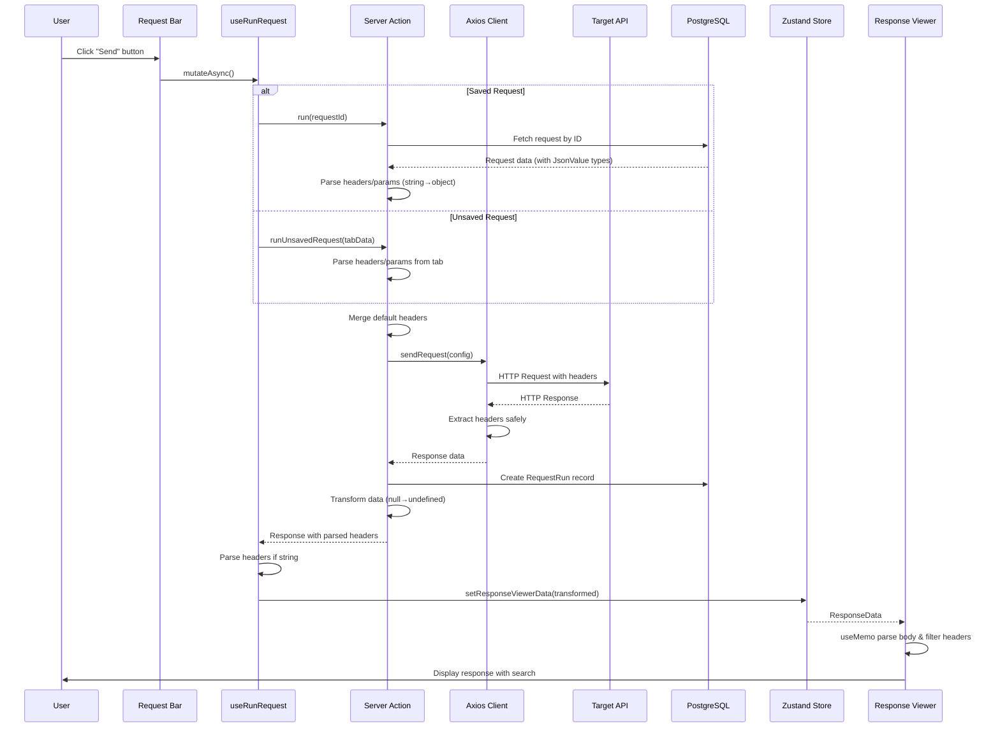

---

## Architecture Decision Records (ADRs)

### ADR-001: Use Object Format for Headers/Parameters

**Context:** Headers and parameters were stored as array of {key, value, enabled} objects.

**Decision:** Convert to object format {key: value} before sending requests.

**Rationale:**
- Axios expects object format
- Simpler data structure
- Matches HTTP spec
- Easier to merge with defaults
- Better TypeScript typing

**Consequences:**
- Need backward compatibility parsing
- One-time conversion on load
- Cleaner API layer

### ADR-002: Always Include Default Headers

**Context:** Many APIs require Content-Type and Accept headers.

**Decision:** Automatically include default headers on all requests.

**Rationale:**
- Reduces repetitive work
- Prevents common errors
- User can still override
- Better UX for beginners

**Default Headers:**
```typescript
{
  'Content-Type': 'application/json; charset=UTF-8',
  'Accept': 'application/json',
  'User-Agent': 'PostBoy/1.0',
}
```

### ADR-003: Support Unsaved Request Execution

**Context:** Users couldn't test requests without saving to database first.

**Decision:** Create `runUnsavedRequest` function that works with tab data directly.

**Rationale:**
- Faster prototyping
- No database clutter
- Matches Postman behavior
- Better user experience

**Implementation:**
- Check if `tab.requestId` exists
- If yes: use `run(requestId)`
- If no: use `runUnsavedRequest(tabData)`

### ADR-004: Transform null to undefined for TypeScript

**Context:** Prisma returns `null` for nullable fields, but TypeScript interfaces expect `undefined`.

**Decision:** Transform all `null` values to `undefined` in response data.

**Rationale:**
- Better TypeScript compatibility
- Matches React conventions
- Avoids `null` checks everywhere
- Cleaner component code

### ADR-005: Use Monaco Editor for Response Display

**Context:** Needed syntax highlighting and code folding for JSON responses.

**Decision:** Integrate Monaco Editor with VS Dark theme.

**Rationale:**
- Industry standard (VS Code engine)
- Excellent JSON support
- Built-in folding
- Customizable
- Read-only mode

**Configuration:**
```typescript
{
  readOnly: true,
  minimap: { enabled: false },
  fontSize: 13,
  fontFamily: "var(--font-mono)",
  wordWrap: "on",
  automaticLayout: true,
  padding: { top: 16, bottom: 16 },
}
```

---

## Testing Considerations

### Areas Requiring Tests

1. **Data Transformation:**
   - Headers: string → object → string
   - Parameters: string → object → string
   - Body: string → JSON → string
   - Null → undefined conversion

2. **Error Handling:**
   - Empty string JSON.parse
   - Malformed JSON
   - Network failures
   - Invalid URLs

3. **Default Headers:**
   - Merging with user headers
   - User headers override defaults
   - Empty headers object

4. **Request Execution:**
   - Saved requests
   - Unsaved requests
   - Missing requestId
   - Invalid data

### Suggested Test Structure

```typescript
describe('useRunRequest', () => {
  it('should execute saved request with requestId', async () => {
    // ...
  });
  
  it('should execute unsaved request without requestId', async () => {
    // ...
  });
  
  it('should parse string headers to object', async () => {
    // ...
  });
  
  it('should handle empty string headers gracefully', async () => {
    // ...
  });
  
  it('should merge default headers with user headers', async () => {
    // ...
  });
});
```

---

## Future Enhancements

### Short Term (v2.1)
- [ ] Remove console.logs after debugging phase
- [ ] Add unit tests for transformation functions
- [ ] Implement request history view
- [ ] Add response time graph
- [ ] Environment variables support

### Medium Term (v2.5)
- [ ] GraphQL support
- [ ] WebSocket testing
- [ ] Mock server
- [ ] Team collaboration
- [ ] API documentation generation

### Long Term (v3.0)
- [ ] CI/CD integration
- [ ] Automated testing
- [ ] Performance monitoring
- [ ] API versioning
- [ ] Custom plugins

---

## Conclusion

Version 2.0.0 represents a major overhaul of the request execution and response handling system. Key achievements:

✅ **Reliability:** Robust error handling at every layer  
✅ **Flexibility:** Support for saved and unsaved requests  
✅ **Usability:** Default headers, toast notifications, search  
✅ **Performance:** Memoization, debouncing, optimizations  
✅ **Type Safety:** Proper transformations and type guards  
✅ **Developer Experience:** Comprehensive logging and debugging  

The system is now production-ready with a solid foundation for future enhancements.
        Row-level Checks
```

---

**Document Version:** 1.0.0  
**Last Updated:** October 1, 2025  
**Maintained By:** PostBoy Development Team
